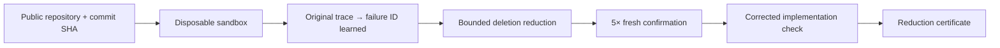

# SequenceProof

> Reduces an already-reproducing stateful trace against a real executable
> repository contract. Runs public, pinned repositories in a disposable
> sandbox. Preserves exact failure identity across fresh executions.

[](https://github.com/Syedsaadhhh/SequenceProof/actions/workflows/test.yml)
[](LICENSE)

SequenceProof targets one narrow debugging problem: long action sequences hide
the state transition that actually causes a failure. Given a repository that
has opted in with a manifest and runner, and a trace that already reproduces a
bug, SequenceProof runs the repository in a disposable sandbox and reduces the
trace only while fresh executions preserve the exact original failure ID.

The payment fixture (`sequenceproof.py`) is a built-in preview and regression
baseline. It is not the product.

## What it does



1. **Resolve** a public GitHub repository at an immutable 40-character commit SHA.
2. **Create** a disposable sandbox (Daytona or Docker).
3. **Execute** the original trace; learn the failure ID from the first real replay.
4. **Reduce** by deleting actions; accept a candidate only when the exact failure ID
   is reproduced by a fresh subprocess with a new run ID and clean state.
5. **Confirm** the reduced proof five times in five independent fresh executions.
6. **Execute** the corrected implementation against the same reduced trace.
7. **Destroy** the sandbox.
8. **Return** a locally reduced proof with a one-minimal certificate when the budget
   permits, or a bounded-local result otherwise.

## What it does not do

- It does not discover bugs automatically. A reproducing trace must be provided.
- It does not support every repository or bug type. Repositories opt in with a
  manifest and runner.
- It does not claim global minimality. Locally reduced means no smaller
  subsequence was found within the bounded budget.
- It does not support private repositories, credentials, setup commands, or
  arbitrary callback URLs in v1.
- It does not fall back silently to the built-in fixture when a sandbox is unavailable.

## Repository opt-in

A repository opts in by adding `.sequenceproof/manifest.json`:

```json
{
  "schema_version": 1,
  "id": "stale-role-service",
  "title": "Stale authorization after account switch",
  "runner": {
    "argv": ["python", "sequenceproof_runner.py"],
    "fixed_argv": ["python", "sequenceproof_runner.py", "--fixed"],
    "timeout_seconds": 15
  }
}
```

The runner reads `$SEQUENCEPROOF_TRACE_PATH` and prints a strict JSON result
as its final stdout line. See [`docs/RUNNER_CONTRACT.md`](docs/RUNNER_CONTRACT.md)
for the full contract.

## Ten-second result (built-in checkout preview)

| Input | Verified output |
| --- | --- |
| 12-step noisy checkout trace | 4-step locally reduced trace |
| `WRONG_CARD_CHARGED` failure | Same failure ID in 5/5 fresh runs |
| Corrected implementation | Same trace does not reproduce |
| Minimality | `one-minimal` certified |

## Install and run

Requires Python 3.10+. No external packages for the built-in preview.

For Daytona sandbox support:

```bash
pip install daytona
export DAYTONA_API_KEY=your_key_here
```

For Docker sandbox support:

```bash
# Requires Docker daemon to be running
docker info
```

```bash
python server.py
```

Open `http://127.0.0.1:8000`. The **Repository proof workspace** is the primary
real-execution path: provide a public GitHub HTTPS URL, immutable 40-character
commit SHA, manifest path, and reproducing trace, then select **Execute in real
sandbox**. Its phase timeline and evidence are populated only from `/api/jobs`.
The lower **Analyze trace** workspace remains the synthetic checkout compatibility
preview backed by `/api/analyze`.

```bash
python -m unittest -v
```

## API

### Compatibility preview (unchanged)

```http
GET  /api/sample
POST /api/analyze
Content-Type: application/json

{"trace": [{"action": "add_item", "item": "notebook"}, ...]}
```

### Sandbox job API (Run 2.5)

```http
GET  /api/sandbox/providers
POST /api/jobs
GET  /api/jobs/{job_id}
DELETE /api/jobs/{job_id}
```

**POST /api/jobs** — returns `202` with a job ID:

```json
{
  "repo_url": "https://github.com/OWNER/REPOSITORY",
  "commit_sha": "40_HEX_CHARACTERS",
  "manifest_path": ".sequenceproof/manifest.json",
  "trace": []
}
```

Poll `GET /api/jobs/{job_id}` for status and result. See
[`docs/RUNNER_CONTRACT.md`](docs/RUNNER_CONTRACT.md) for job phases and
response shapes.

## Repository map

```text
.
├── core.py                        # Protocol-agnostic bounded reducer kernel
├── runner_contract.py             # Manifest, job-request, runner-output models
├── repository_runner.py           # Provider-neutral orchestration
├── jobs.py                        # Bounded job store and phase history
├── sequenceproof.py               # Checkout compatibility preview (not the product)
├── server.py                      # HTTP API server
├── sandbox/
│   ├── base.py                    # SandboxProvider protocol
│   ├── daytona_provider.py        # Hosted cloud sandbox (Daytona SDK)
│   ├── docker_provider.py         # Local Docker sandbox
│   └── fake_provider.py           # Deterministic test provider (tests only)
├── examples/stale-role-service/   # Real executable opt-in fixture
│   ├── service_buggy.py           # Buggy implementation
│   ├── service_fixed.py           # Corrected implementation
│   ├── sequenceproof_runner.py    # v1 runner
│   ├── .sequenceproof/manifest.json
│   ├── traces/                    # Sample traces (noisy, non-reproducing, invalid)
│   └── test_runner.py             # Runner unit tests
├── test_kernel.py                 # Run 2.5 regression tests (16 categories)
├── test_sequenceproof.py          # Checkout compatibility tests
├── test_server.py                 # HTTP contract tests
├── index.html                     # Semantic application shell
├── static/                        # Frontend styles and logic
├── docs/
│   ├── ARCHITECTURE.md
│   ├── BUILD_LOG.md
│   └── RUNNER_CONTRACT.md         # Repository opt-in contract
├── .env.example                   # Environment variable template
└── bob_sessions/                  # Real IBM Bob task evidence
```

See [the architecture](docs/ARCHITECTURE.md) and [observed build log](docs/BUILD_LOG.md).

## IBM Bob IDE Development Workflow

SequenceProof was designed and engineered using **IBM Bob IDE** as the primary pair-programming and agentic development environment:

- **Proof invariant & failure oracle:** Task 01 utilized IBM Bob to develop the exact-failure invariant (`WRONG_CARD_CHARGED` and `STALE_ROLE_AUTHORIZATION`), ensuring that candidate traces are only accepted when fresh state execution reproduces the identical failure ID.
- **Sandbox adapter kernel & cleanup:** Task 02 leveraged IBM Bob to implement the repository runner, the protocol-agnostic reduction kernel, provider isolation (Daytona and Docker), and truthful cleanup reporting with independent deletion verification.
- **Session evidence:** Authentic IBM Bob session task summary screenshots are preserved in [`bob_sessions/`](bob_sessions/):
  - `bob_sessions/sequenceproof_task01_proof_invariant_summary.png` (proof invariant & oracle)
  - `bob_sessions/sequenceproof_task02_sandbox_kernel_summary.png` (sandbox kernel & cleanup verification)

> **Architectural Boundary Note:** IBM Bob IDE was used strictly as the development and engineering environment. IBM Bob does not execute as an internal component or runtime service inside the deployed web application.

## Honest positioning

- "Reduces an already-reproducing stateful trace against a real executable repository contract."
- "Runs public, pinned repositories in a disposable sandbox."
- "Preserves exact failure identity across fresh executions."
- "Locally reduced; one-minimal only when certified."
- "The included payment fixture is a preview, not the product."
- "Repositories opt in with a manifest and runner."
- "IBM Bob IDE was used as the engineering pair programmer, not a runtime API."

## License

MIT. See [LICENSE](LICENSE).
