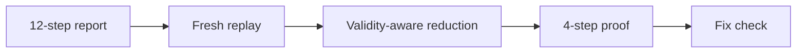

# SequenceProof

> Turn a long stateful bug report into a short, verified reproduction—and prove
> the fix stops the same failure.

[](https://github.com/Syedsaadhhh/SequenceProof/actions/workflows/test.yml)
[](LICENSE)

SequenceProof targets one narrow debugging problem: long action sequences hide
the state transition that actually causes a failure. The executable checkout
sample starts with 12 actions. A customer begins checkout with card A, switches
to card B, and retries payment; the retry incorrectly charges card A.

The current build finds a four-action reproduction, confirms the same
`WRONG_CARD_CHARGED` failure in five fresh runs, and checks that the corrected
implementation passes the identical trace.

## Ten-second result

| Input | Verified output |
| --- | --- |
| 12-step noisy checkout trace | 4-step locally reduced trace |
| Wrong card after retry | Same failure ID in 5/5 fresh runs |
| Corrected implementation | Same trace does not reproduce |



## Why this is different

A shorter trace is useful only when it remains valid and demonstrates the same
bug. SequenceProof combines four checks in one workflow:

1. **State validity** — invalid candidates never count as evidence.
2. **Failure identity** — reduction must retain the exact observed failure ID.
3. **Fresh confirmation** — the result is replayed five times from clean state.
4. **Fix verification** — the same reduced trace runs against corrected code.

The reducer may prune a dependent action orphaned by a deletion, but it never
inserts or reorders actions. Every resulting candidate is executed again.

## Run

Requires Python 3.10+; no external packages.

```bash
python server.py
```

Open `http://127.0.0.1:8000` and select **Analyze trace**. The UI calls the
actual `/api/analyze` endpoint. Edit the JSON to test another card, remove a
necessary step, or make a passing trace. Download the execution result as JSON.

```bash
python -m unittest -v
```

For Docker:

```bash
docker build -t sequenceproof .
docker run --rm -p 8000:8000 sequenceproof
```

The server honors `PORT` and `HOST`. `GET /api/sample` is a lightweight smoke
endpoint.

## API

```http
GET /api/sample
POST /api/analyze
Content-Type: application/json

{"trace": [{"action": "add_item", "item": "notebook"}]}
```

The analysis response separates `INVALID_TRACE`, `NOT_REPRODUCED`,
`REPRODUCED`, and `FLAKY`. Verified results include the reduced steps, five
trial outcomes, every mismatching retry, a one-minimality certificate when the
bounded budget permits it, candidate-check count, orphan-pruning count,
corrected-code result, and runtime for this sample.

## What the proof means

- A valid trace is executed from fresh state. The failure oracle checks every recorded retry attempt and reports `WRONG_CARD_CHARGED` when the card actually charged differs from the card active at that retry moment. The response exposes the complete `mismatches` list; `expected` and `actual` remain aliases for the first mismatch for compatibility.
- Reduction uses bounded `ddmin` with up to 250 candidate checks. A checkout-specific repair pass prunes orphaned `remove_item`, `begin_checkout`, and `retry_payment` steps when their prerequisite disappears. It never inserts or reorders actions. Every repaired candidate still needs a valid fresh replay with the same `WRONG_CARD_CHARGED` failure ID; malformed parameters stay invalid.
- The reduced trace is replayed five times from fresh state. The corrected implementation is then run on that same reduced trace.
- This is a **locally reduced** trace, not a proof of globally shortest sequence. When `minimality.certified` is true, the bounded verifier has additionally confirmed that no single retained step can be removed while preserving the exact failure ID. Results are limited to this owned sample project. No reported time saving has been measured against manual work.
- `INVALID_TRACE` and `NOT_REPRODUCED` are separate outcomes. The current deterministic fixture cannot demonstrate a true flaky result; the status is reserved for future nondeterministic cases.

## Data and scope

The source, issue text, and action traces were authored for this sample. They contain no client or personal data. This prototype does not accept arbitrary repositories, run untrusted code, or use a live payment provider. The simulated card identifiers are fictional strings.

## IBM Bob 2.0 build workflow

IBM Bob IDE is the required engineering workspace for this hackathon. Open this
repository with the hackathon-provisioned account and use Bob for meaningful
inspection, implementation, testing, and review:

1. Inspect `sequenceproof.py`, identify the failure oracle and the limitations of the reducer. Ask Bob to propose a falsifiable additional stateful case.
2. Use Bob Agent mode to implement the new case or improve validity-aware reduction. Run tests and show the actual changes and results.
3. Use Bob to review failure classification and fix any observed issue. Capture the task consumption summary PNGs after each relevant task.

After each relevant task, open its task header and save the real consumption
summary PNG under `bob_sessions/`. The application does not claim a live Bob
runtime API.

## Repository map

```text
.
├── sequenceproof.py          # state machine, replay, reducer, proof
├── server.py                 # API and allowlisted static-file server
├── index.html                # semantic application shell
├── static/                   # frontend styles and state/rendering logic
├── test_sequenceproof.py     # behavior tests
├── test_server.py            # HTTP, asset, and API contract tests
├── AGENTS.md                 # build constraints for IBM Bob and contributors
├── docs/                     # architecture and observed build log
└── bob_sessions/             # required real IBM Bob task evidence
```

See [the architecture](docs/ARCHITECTURE.md) and [observed build log](docs/BUILD_LOG.md).

## License

MIT. See [LICENSE](LICENSE).

## Next checks

Confirm the submission form's exact required fields and deadline. Run the app from a clean machine, record a short demo of the actual result, and add only measured claims to the presentation.
