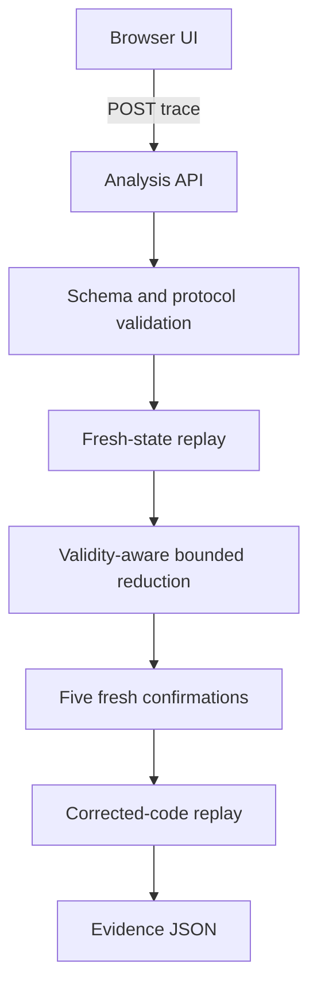

# Architecture

## Components

| Component | Responsibility |
| --- | --- |
| `index.html` | Editable trace, analysis controls, result comparison, evidence download |
| `server.py` | Static page and JSON API with request-size boundary |
| `sequenceproof.py` | Checkout state machine, validation, failure oracle, reduction, fix check |
| `test_sequenceproof.py` | Positive, negative, validity, and exact-failure tests |

## Proof boundary

A result is a verified reproduction when the original valid trace produces a
failure ID, the reduced trace produces the same ID in five fresh trials, and
the corrected implementation does not reproduce it. This proves behavior in
the included deterministic sample only.

