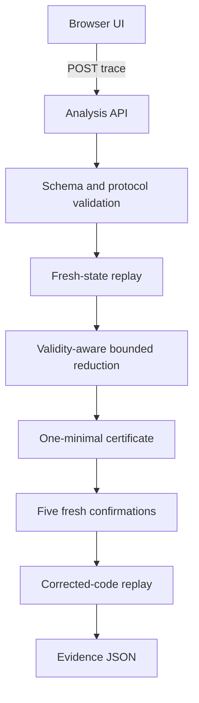

# Architecture

## Components

| Component | Responsibility |
| --- | --- |
| `index.html` | Semantic application shell |
| `static/styles.css` | Enterprise visual system, responsive layout, and accessible states |
| `static/app.js` | Editable trace, API state handling, result comparison, complete mismatch evidence, and JSON download |
| `server.py` | Allowlisted static assets and JSON API with request-size boundary |
| `sequenceproof.py` | Checkout state machine, complete retry evidence, validation, bounded reduction, one-minimal certificate, and fix check |
| `test_sequenceproof.py` | Positive, negative, validity, mismatch, and exact-failure tests |
| `test_server.py` | HTTP asset allowlist and API contract tests |

## Proof boundary

A result is a verified reproduction when the original valid trace produces a
failure ID, the reduced trace produces the same ID in five fresh trials, and
the corrected implementation does not reproduce it. When the bounded budget
permits, the response also certifies that removing any one retained step loses
the exact failure. This remains a local, not global-minimum, guarantee for the
included deterministic protocol.

