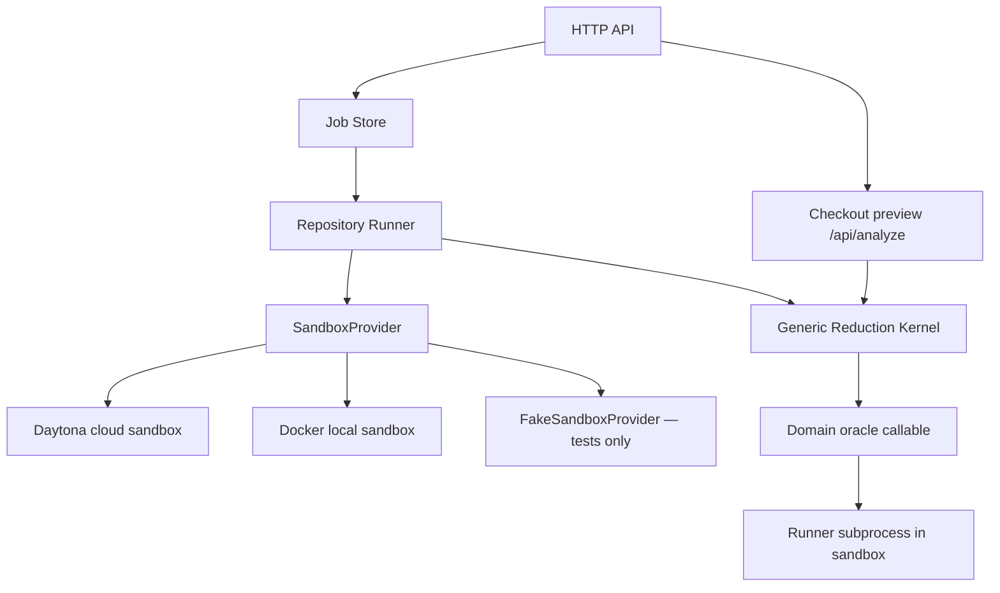

# Architecture

## System overview



## Components

| Component | Responsibility |
| --- | --- |
| `core.py` | Protocol-agnostic bounded ddmin reduction, one-minimal certificate, fresh confirmation. No domain knowledge. |
| `runner_contract.py` | Strict manifest, job-request, and runner-output models with validation. |
| `sandbox/base.py` | `SandboxProvider` protocol — interface all providers implement. |
| `sandbox/daytona_provider.py` | Hosted cloud sandbox via official Daytona Python SDK. |
| `sandbox/docker_provider.py` | Local Docker sandbox with security limits. |
| `sandbox/fake_provider.py` | Deterministic local-subprocess provider for unit tests only. Never selectable via HTTP. |
| `repository_runner.py` | Clones repo, loads manifest, builds oracle, calls `core`, destroys sandbox in finally. |
| `jobs.py` | Bounded in-memory job store with truthful phase/event history. |
| `server.py` | Allowlisted static assets, compatibility `/api/analyze`, sandbox job API. |
| `sequenceproof.py` | Checkout state machine and compatibility preview. Delegates reduction to `core.py`. |
| `examples/stale-role-service/` | Real executable opt-in fixture demonstrating the v1 runner contract. |
| `test_kernel.py` | 16-category regression tests for the sandbox kernel. |
| `test_sequenceproof.py` | Checkout compatibility and oracle behavior tests. |
| `test_server.py` | HTTP asset allowlist and API contract tests. |
| `index.html` | Semantic application shell. |
| `static/styles.css` | Enterprise visual system. |
| `static/app.js` | Synthetic checkout compatibility preview. |
| `static/repository.js` | Real provider discovery, POST /api/jobs, server-backed polling, evidence and JSON export. |
| `test_repository_ui.py` | HTTP integration using real local runner subprocesses plus UI asset, input validation and concurrency tests. |

## Architectural boundary

The generic reduction kernel (`core.py`) is strictly isolated:

- It accepts an opaque oracle callable and a list of opaque action dicts.
- It contains no knowledge of checkout, cards, role names, access-control
  actions, or any specific failure ID.
- It is verified by test to contain no checkout action names or known failure IDs.
- `sequenceproof.py` bridges to it through a domain-specific oracle closure
  that applies checkout orphan-pruning and calls `replay()`.

## Repository opt-in flow

```
Repository
  └── .sequenceproof/manifest.json   ← schema_version, id, title, runner
  └── sequenceproof_runner.py        ← reads $SEQUENCEPROOF_TRACE_PATH, prints JSON

SequenceProof
  1. validate manifest
  2. for each candidate trace:
       a. git reset --hard <pinned SHA> && git clean -fdx  (restore exact state)
       b. write candidate JSON to unique $SEQUENCEPROOF_TRACE_PATH
       c. set unique $SEQUENCEPROOF_RUN_ID
       d. exec manifest.runner.argv (no shell)
       e. parse final stdout line as RunnerOutput
  3. accept candidate iff status==REPRODUCED and failure_id==original_failure_id
```

## Security boundary

| Control | v1 implementation |
| --- | --- |
| URL allowlist | `https://github.com/<owner>/<repo>` only |
| Commit | Exactly 40-hex immutable SHA; branch refs rejected |
| Sandbox isolation | Daytona: cloud-isolated process; Docker: `--network none --read-only --user 1000` |
| Host secrets | `DAYTONA_API_KEY` and `GITHUB_TOKEN` are stripped from sandbox env |
| Output limit | 64 KiB per runner invocation |
| Payload limit | 32 KiB request |
| Action limit | 40 trace actions |
| Shell injection | Strictly validated manifest argv and manifest paths; Daytona executes sanitized commands inside the disposable sandbox, not on the host |
| Manifest paths | Strict relative-path character allowlist; shell metacharacters, absolute paths and `..` rejected |
| Provider selection | `FakeSandboxProvider` is never selectable via HTTP |
| Cleanup | `destroy_sandbox` requested from `finally` after every created sandbox; external deletion confirmation is recorded separately |

**Documented boundaries that cannot be fully enforced in v1:**
- Daytona network isolation depends on the Daytona cloud environment.
- Docker CPU/memory limits depend on the host kernel cgroups support.

## Job phases

```
QUEUED → STARTING_SANDBOX → CHECKING_OUT_REPOSITORY → REPRODUCING_ORIGINAL
       → REDUCING → CONFIRMING → VERIFYING_FIXED
       → COMPLETED | FAILED | CANCELLED
```

Every transition is caused by real backend work. No percentage progress is
fabricated.

## Proof boundary

A result is locally reduced when: the original trace reproduces the failure,
the reduced trace (an ordered subsequence) reproduces the same failure ID in
five fresh independent executions, and the corrected implementation does not
reproduce it. When `minimality.certified` is true, the bounded verifier has
confirmed that no single retained step can be removed while preserving the
exact failure ID. This is a local, not global-minimum, guarantee.
